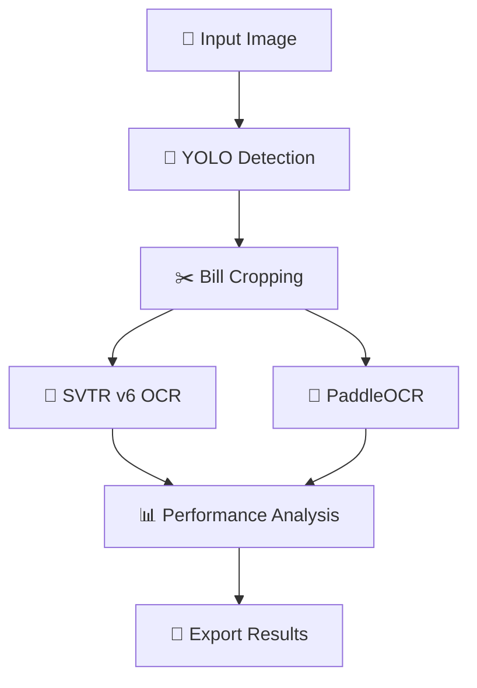

# 🚀 AI OCR Pipeline – Bill Recognition (GUI + Core)
**Author:** Tôn Thất Thanh Tuấn  
**Date:** 2025-08-25

This system combines **YOLOv8** (detection), **SVTR v6** (primary OCR), and **PaddleOCR** (backup/comparison), with a modern **PySide6** GUI. This README merges the content of `README.md` (overview & pipeline) and `README_GUI.md` (GUI highlights).

---

## 🧭 Table of Contents
- [Overview](#overview)
- [GUI Highlights (Distinctive points from README_GUI)](#gui-highlights-distinctive-points-from-readme_gui)
- [Key Features](#key-features)
- [Quick Start](#quick-start)
- [How to Use](#how-to-use)
- [Architecture & Processing Flow](#architecture--processing-flow)
- [Project Structure](#project-structure)
- [Configuration & Tuning](#configuration--tuning)
- [Performance & Comparison](#performance--comparison)
- [Screenshots](#screenshots)
- [Development & Contributing](#development--contributing)
- [Acknowledgments & Contact](#acknowledgments--contact)

---

## 🌟 Overview
**Bill OCR System** is an AI application that automatically detects bill/receipt regions and recognizes text with high accuracy. The pipeline consists of:
- **🎯 YOLO v8**: Detect and crop bill regions
- **🤖 SVTR v6**: Primary OCR with strong accuracy
- **🧠 PaddleOCR**: Backup OCR and cross-checking

The GUI is in Vietnamese, with a dark theme and real‑time result analytics.

---

## 🎨 GUI Highlights (Distinctive points from README_GUI)
> This section summarizes what makes the GUI build special.

### 🖼 3‑Panel Modern Layout
- **Image Input (~35%)** – select & preview images
- **YOLO Detection (~35%)** – visualize detection results
- **OCR Results (~30%)** – tabular results & comparisons

### 🎨 Modern Dark Theme & UX
- Professional dark theme with green accent
- Modern buttons (hover), tables with **color‑coded confidence**:
  - >0.95: deep green • >0.85: light green • >0.7: yellow • >0.5: orange • ≤0.5: red
- **Collapsible Log Window**, **separate real‑time status** for detection and OCR
- **Auto‑scaling** images, borders indicating states

### 🔧 UI/Tech Components
- **QSplitter** (3‑panel), **QTabWidget** (tabs: Model Comparison, SVTR v6, PaddleOCR)
- **QTableWidget** (advanced tables), **QScrollArea** (zoom/scroll images)
- Custom CSS on top of Fusion style

> These points differentiate the GUI edition (from `README_GUI.md`) from the core pipeline described in `README.md`, focusing on user experience.

---

## 📋 Key Features
### 🔍 Detection & Processing
- Auto detection (YOLO) → Smart cropping → Pre‑processing
- Dual OCR (SVTR v6 + PaddleOCR) & **Confidence Analysis**

### 📊 Analytics & Stats
- Compare two engines with 10+ metrics
- Intuitive tables and charts

### 🎛 GUI & UX
- Vietnamese UI, **real‑time progress**, **responsive layout**
- Modern layout prioritizing Detection & Results areas

### 💾 Export & Storage
- **Export JSON** (bbox, confidence, timestamps)
- Batch processing & history (in progress)

---

## 🚀 Quick Start

### 1) Environment check
```bash
python -m venv venv
source venv/bin/activate   # Linux/macOS
venv\Scripts\activate      # Windows
pip install -r requirements.txt
python test_setup.py
```

### 2) Run the app
**Linux:**
```bash
./run_linux.sh
```
**Windows:**
```cmd
run_windows.bat
```
**Manual:**
```bash
python ocr_pipeline_gui.py       # open the modern GUI
python demo_complete_pipeline.py # run the full pipeline (CLI)
python benchmark_ocr.py --images 10  # quick benchmark
```

> If you run in Docker/WSL/headless without a display:
> ```bash
> xvfb-run -s "-screen 0 1920x1080x24" python ocr_pipeline_gui.py
> ```

---

## 🎮 How to Use
1. **Select an image**: click “📁 Select Image” (see samples in `image_test/`)
2. **Process**: click “🚀 Process” to run detection + OCR
3. **Analyze**: review tabs **Model Comparison / SVTR v6 / PaddleOCR**
4. **Export JSON**: click “💾 Export” to save results (with metadata)

Optimized flow: **Select → Process → Analyze → Export**.

---

## 🏗 Architecture & Processing Flow

### Mermaid – Overall Pipeline


### UI – 3‑column layout (ASCII)
```
┌─────────────────────────────────────────────────────────────────────────────┐
│                    AI OCR Pipeline • YOLO Detection • SVTR v6 • PaddleOCR   │
├─────────────┬─────────────────────────────────────┬─────────────────────────┤
│ 📁 Select   │              🎯 YOLO Detection       │    📊 OCR Analysis    │
│ 🚀 Process  │          Analysis & Visualization    │       Results           │
│ 💾 Export   │                                     │                         │
├─────────────┼─────────────────────────────────────┼─────────────────────────┤
│📷 Image    |                                      │ 📊 Model Comparison     │
│  Input      │         Detection Display           │ 🤖 SVTR v6 Details     │
│             │       with Statistics               │ 🧠 PaddleOCR Details   │
│ ┌─────────┐ │                                     │                         │
│ │Original │ │                                     │ Tables with confidence  │
│ │Bill Crop│ │                                     │ color-coding            │
│ └─────────┘ │                                     │                         │
├─────────────┴─────────────────────────────────────┴─────────────────────────┤
│ Status: Ready • 📋 Show/Hide Logs                                           │
└─────────────────────────────────────────────────────────────────────────────┘
```

---

## 📁 Project Structure
```
Bill_Detect/
├── ocr_pipeline_gui.py          # main GUI
├── YOLO_Coor.py                 # YOLO detector
├── test_setup.py                # environment check
├── requirements.txt             # dependencies
├── HUONG_DAN_CAI_DAT.md         # installation guide
├── run_linux.sh                 # Linux script
├── run_windows.bat              # Windows script
├── bill_models.pt               # YOLO model
├── image_test/                  # test images
├── svtr_v6_ocr/                 # SVTR v6 model
├── yolo_detect_bill/            # YOLO detector dir
└── training_data/               # training data
```

---

## ⚙️ Configuration & Tuning
Tunable parameters in code (typical defaults):
- **YOLO confidence threshold**: `0.1` (inside `OCRProcessingThread`)
- **Max image display size**: `600px` (image view helper)
- **Crop padding**: `10px` (YOLO → crop pipeline)

---

## ⚡ Performance & Comparison
| Model | Texts Detected | Avg Confidence | High Conf (>0.9) | Processing Time |
|---|---|---|---|---|
| **SVTR v6** | 44 | 0.931 | 89% | ~2.3s |
| **PaddleOCR** | 108 | 0.913 | 67% | ~1.8s |

- **SVTR v6**: fewer texts but higher accuracy  
- **PaddleOCR**: more texts but potentially noisier  
- **Recommendation**: Combine both for balanced **coverage** and **accuracy**

---

## 🖼 Screenshots
- `docs/screenshots/main_interface.png`
- `docs/screenshots/analysis_results.png`
- `docs/screenshots/yolo_detection.png`

*(More to be added)*

---

## 🧑‍💻 Development & Contributing
**Code style:** Python 3.8+, PySide6, PEP 8, complete docstrings (EN for technical, VI for UI).  
**Contribution flow:**
1. Fork → create branch `feature/*`
2. Commit & Push
3. Open a Pull Request

**Bug report:** include OS, Python version, full logs, reproduction steps, screenshots (if any).

---

## 🙏 Acknowledgments & Contact
- **YOLOv8** – Ultralytics
- **SVTR** – STR research community
- **PaddleOCR** – PaddlePaddle team
- **PySide6/Qt** – Qt team

**Author:** Tôn Thất Thanh Tuấn
