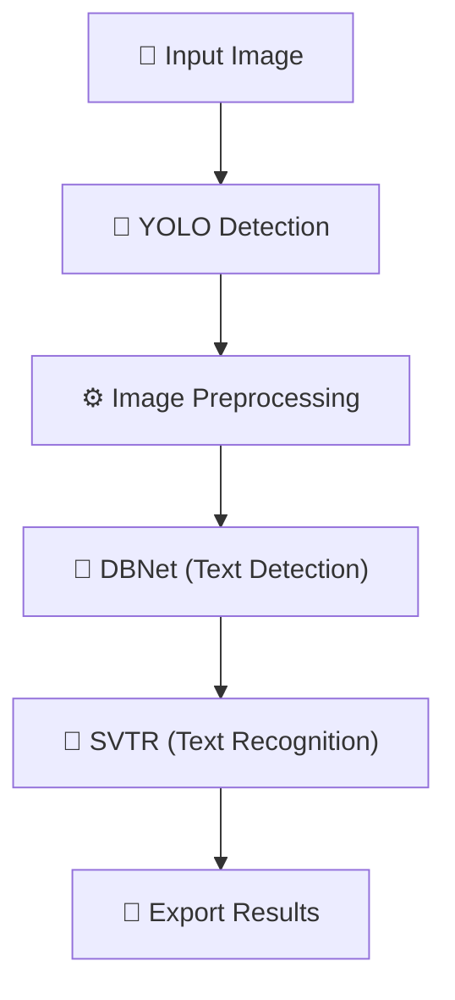

# 🚀 AI OCR Pipeline – Bill Recognition (GUI + Core)
**Author:** Tôn Thất Thanh Tuấn  
**Date:** 2025-08-25

This system combines **YOLOv8** (detection), **SVTR v6** (primary OCR), and **PaddleOCR** (backup/comparison), all integrated into a modern **PySide6** GUI. This README merges an overview of the pipeline with details on the GUI and project structure.

---

## 🧭 Table of Contents
- [Overview](#overview)
- [GUI Highlights](#gui-highlights)
- [Key Features](#key-features)
- [Quick Start](#quick-start)
- [How to Use](#how-to-use)
- [Architecture & Processing Flow](#architecture--processing-flow)
- [Project Structure](#project-structure)
- [Configuration & Tuning](#configuration--tuning)
- [Performance & Comparison](#performance--comparison)
- [Screenshots](#screenshots)
- [Development & Contributing](#development--contributing)
- [Acknowledgments & Contact](#acknowledgments--contact)

---

## 🌟 Overview
**Bill OCR System** is an AI application that automatically detects bill/receipt regions and recognizes text with high accuracy. The pipeline consists of:
- **🎯 YOLO v8**: Detects and crops bill regions from the input image.
- **🤖 SVTR v6**: Performs primary OCR with high accuracy.
- **🧠 PaddleOCR**: Works as a backup OCR engine and for cross-checking results.

The GUI (implemented in Vietnamese) uses a modern dark theme and provides real‑time result analytics.

---

## 🎨 GUI Highlights
> This section summarizes what makes the GUI interface special.

### 🖼 3‑Panel Modern Layout
- **Image Input (~35%)** – select & preview images.
- **YOLO Detection (~35%)** – visualize detection results.
- **OCR Results (~30%)** – displays tabular results & model comparison.

### 🎨 Modern Dark Theme & UX
- Professional dark theme with green accent.
- Modern buttons with hover effects and tables with **color‑coded confidence**:
  - >0.95: deep green • >0.85: light green • >0.7: yellow • >0.5: orange • ≤0.5: red
- **Collapsible Log Window** and separate real‑time status panels for detection and OCR.
- **Auto‑scaling** images with borders indicating status.

### 🔧 UI/Tech Components
- **QSplitter** for the 3‑panel layout.
- **QTabWidget** (tabs: Model Comparison, SVTR v6 Details, PaddleOCR Details).
- **QTableWidget** for detailed results and **QScrollArea** for image viewing.
- Custom CSS on top of the Fusion style.

> These enhancements focus on a responsive UX and clear visualization of both detection and OCR outputs.

---

## 📋 Key Features
### 🔍 Detection & Processing
- Automatic detection (YOLO) → Smart cropping → Pre‑processing.
- Dual OCR (SVTR v6 + PaddleOCR) with confidence analysis.

### 📊 Analytics & Stats
- Compare two OCR engines with multiple performance metrics.
- Intuitive tables and charts for analysis.

### 🎛 GUI & UX
- Vietnamese UI with real‑time progress and responsive layout.
- Modern interface prioritizing detection and results display.

### 💾 Export & Storage
- **Export JSON** files (including bounding boxes, confidence scores, timestamps).
- Batch processing envisaged for history management.

---

## 🚀 Quick Start

### 1) Environment Setup
```bash
python 3.10 -m venv venv
pip install -r requirements.txt
```

## 🖥 System Requirements

- **Python:** 3.10 (tested and recommended)
- **Operating System:** Windows 10/11 (64-bit)
- **GPU (optional):** NVIDIA GPU with CUDA/cuDNN for acceleration (otherwise runs on CPU)
- **RAM:** ≥ 8GB recommended for smooth processing

### 2) Run the App
```bash
python run.py gui
python run.py benchmark_ocr
python run.py check_model
```

> After installing the requirements, simply run **python run.py [benchmark_ocr | check_model | gui]** to start the application.

---

## 🎮 How to Use
1. **Select an Image**: Click “📁 Select Image” (sample images are in `image_test/`).
2. **Process**: Click “🚀 Process” to run detection and OCR.
3. **Analyze**: Review the results in the “Model Comparison”, “SVTR v6 Details”, and “PaddleOCR Details” tabs.
4. **Export JSON**: Click “💾 Export” to save the result (includes metadata).

Streamlined flow: **Select → Process → Analyze → Export**.

---

## 🏗 Architecture & Processing Flow

### Mermaid – Overall Pipeline


### UI Layout (ASCII Diagram)
```
+--------------------------+--------------------------+------------------------+
|    Select / Process /    |      YOLO Detection      |      OCR Analysis      |
|          Export          |   Visualization & Stats  |    Result Comparison   |
+==========================+==========================+========================+
| Image Input              | Detection Display        | Model Comparison       |
| [Original / Cropped]     | with Statistics          | and Detailed Breakdown |
+--------------------------+--------------------------+------------------------+
```

---

## 📁 Project Structure
```
receipt-detection/
├── test_setup.py              # Environment and dependency check
├── requirements.txt           # Dependencies list
├── image_test/                # Sample images for testing
├── gui_result/                # Folder for exported JSON results (auto-created)
├── benchmark_ocr_result/      # Folder for exported JSON results (auto-created)
├── src/
│  ├── gui.py
│  ├── benchmark_ocr.py
│  └── check_model.py
├── yolo_detect_bill/          # YOLO detection module and models
│   └── bill_models.pt         # YOLO model file (used via subfolder path)
├── svtr_v6_ocr/               # SVTR v6 OCR module and models
│   └── svtr_model.onnx        # (Example) SVTR v6 model file – update if needed
└── paddle_ocr/                # PaddleOCR module and models
    └── paddle_model.pdparams  # (Example) PaddleOCR model parameters – update if needed
```

---

## ⚙️ Configuration & Tuning
Key tunable parameters (typically found in the code):
- **YOLO confidence threshold**: `0.1` (in `OCRProcessingThread`).
- **Image display maximum size**: `600px`.
- **Cropping padding**: `10px` (applied in YOLO detection).

---

## ⚡ Performance & Comparison
| Model        | Texts Detected | Avg Confidence | High Conf (>0.9) | Processing Time |
|--------------|----------------|----------------|------------------|-----------------|
| **SVTR v6**  | 44             | 0.931          | 89%              | ~2.3s           |
| **PaddleOCR**| 108            | 0.913          | 67%              | ~1.8s           |

- **SVTR v6**: Returns fewer texts but with higher accuracy.
- **PaddleOCR**: Returns more texts with slightly lower overall confidence.
- **Recommendation**: Use a combination to balance coverage and accuracy.

---

## 🖼 Screenshots
- `docs/screenshots/main_interface.png`
- `docs/screenshots/analysis_results.png`
- `docs/screenshots/yolo_detection.png`
*(Additional screenshots can be added.)*

---

## 🧑‍💻 Development & Contributing
**Code Style:** Python 3.8+, PySide6, PEP 8, comprehensive docstrings  
**Contribution Flow:**
1. Fork the repository and create a branch (`feature/*`).
2. Commit & push your changes.
3. Open a Pull Request.

**Bug Reports:** Include OS, Python version, full logs, reproduction steps, and screenshots (if any).

---

## 🙏 Acknowledgments & Contact
- **YOLOv8** – Ultralytics
- **SVTR v6** – STR research community
- **PaddleOCR** – PaddlePaddle team
- **PySide6/Qt** – Qt team

**Author:** Tôn Thất Thanh Tuấn  
Feel free to reach out for questions or contributions.
